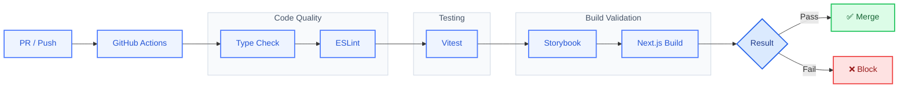
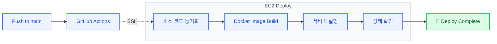
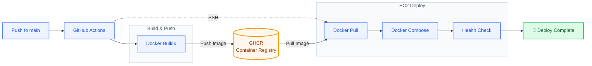

## 👥 Coworkers

> 프로젝트 생성부터 일정 관리, 할 일 관리, 초대까지 팀 협업에 필요한 기능을 제공하는 협업 플랫폼

🏆 **프론트엔드 엔지니어 부트캠프 우수 프로젝트상(1위)**

🌐 **[서비스 둘러보기](https://서비스주소)**

<strong>🔑 테스트 계정 확인하기</strong>

 

- **아이디:** `test@testest.com`
- **비밀번호:** `asdf1234!`

> 해당 계정은 서비스 체험을 위한 테스트 전용 계정입니다.

 

## 주요 역할

### 렌더링 성능 개선

메인 페이지의 LCP를 **2.6초에서 1.3초로 약 50% 개선**했습니다.

- LCP 이미지 요청 방식 개선
- 이미지 크기 및 `sizes` 최적화
- 초기 로딩 폰트 정리
- Lighthouse와 Chrome Performance를 함께 사용해 병목 구간 분석

### Github actions CI 구축

### CD 파이프라인 개선 제안

#### 기존 방식

초기에는 GitHub Actions가 EC2에 직접 접속하여 서버에서 이미지를 빌드하고 서비스를 배포하는 구조를 사용했습니다.

하지만 EC2에서 매번 이미지를 직접 빌드하면서 배포 시간이 길어졌고, 서버의 CPU와 메모리 자원을 빌드 과정이 함께 사용해 배포 안정성도 낮아지는 문제가 있었습니다.

이를 개선하기 위해 인프라 담당자에게 **GitHub Actions에서 이미지를 미리 빌드한 뒤 GHCR에 저장하고, EC2에서는 완성된 이미지만 내려받아 실행하는 방식**을 제안했습니다.

#### 제안한 방식

#### 도입 결과

##### 기존 방식

  

##### 개선 방식

  

EC2에서 Docker 이미지를 직접 빌드하던 기존 방식은 캐시가 적용된 재배포에서도 약 6분 42초가 소요되었습니다. 
GHCR에서 미리 빌드한 이미지를 내려받아 실행하는 구조로 전환한 결과, 배포 시간을 **1분 37초까지 줄여 약 76% 단축**했습니다.

| 배포 방식 | 배포 시간 |
|---|---:|
| EC2 직접 빌드 | **6분 42초** |
| GHCR 기반 배포 | **1분 37초** |
| 개선 결과 | **약 76% 단축** |
