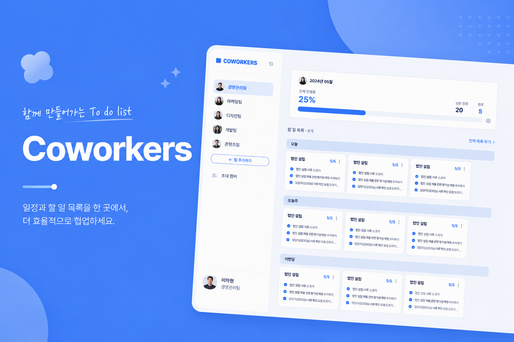
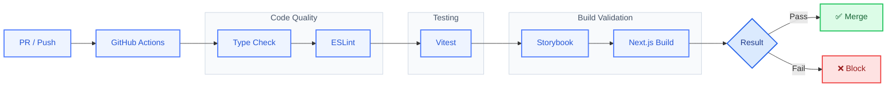
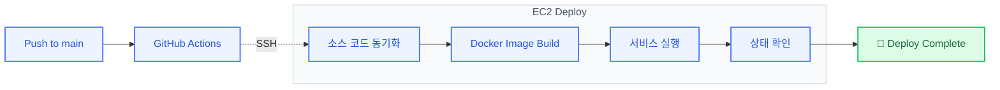
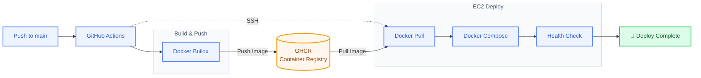
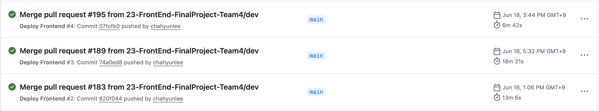
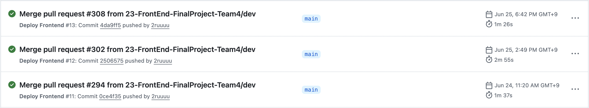

## 👥 Coworkers

> 프로젝트 생성부터 일정 관리, 할 일 관리, 초대까지 팀 협업에 필요한 기능을 제공하는 협업 플랫폼

🏆 **프론트엔드 엔지니어 부트캠프 우수 프로젝트상(1위)**

🌐 **[서비스 둘러보기](https://서비스주소)**

<strong>🔑 테스트 계정 확인하기</strong>

 

- **아이디:** `test@testest.com`
- **비밀번호:** `asdf1234!`

> 해당 계정은 서비스 체험을 위한 테스트 전용 계정입니다.

 

## 주요 역할

### 🚀 GitHub Actions CI 구축

> [!NOTE]
> Pull Request와 Push 시 **Type Check → ESLint → Vitest → Storybook Build → Next.js Build**를 순차적으로 수행하도록 CI를 구축했습니다. 검증을 모두 통과한 경우에만 병합이 가능하도록 하여 코드 품질과 배포 안정성을 확보했습니다.

---

## 🚀 CD 파이프라인 개선 제안

👉 [EC2 직접 빌드에서 GHCR 기반 배포로 전환한 과정 자세한 스토리](https://velog.io/@chahyunnee/GitHub-Actions-CD-%EC%B5%9C%EC%A0%81%ED%99%94-Docker-Hub-%EB%8C%80%EC%8B%A0-GHCR%EC%9D%84-%EC%84%A0%ED%83%9D%ED%95%9C-%EC%9D%B4%EC%9C%A0)

### 기존 방식

초기에는 GitHub Actions가 EC2에 직접 접속하여 서버에서 이미지를 빌드하고 서비스를 배포하는 구조를 사용했습니다.

> [!NOTE]
> 기존 구조에서는 **EC2가 서비스 실행과 Docker 이미지 빌드를 모두 담당**했습니다. 배포 시마다 서버에서 Docker 이미지를 새로 빌드하면서 CPU와 메모리를 함께 사용했고, 배포 시간이 길어질 뿐 아니라 운영 중인 서비스에도 영향을 줄 수 있는 구조였습니다.

---

### 개선 제안

빌드 환경과 실행 환경을 분리하기 위해 **GitHub Actions에서 Docker 이미지를 미리 빌드하여 GHCR에 저장하고, EC2에서는 완성된 이미지만 내려받아 실행하는 구조**를 인프라 담당자에게 제안했습니다.

> [!NOTE]
> GitHub Actions에서 Docker 이미지를 먼저 빌드한 뒤 GHCR에 저장하도록 변경하여 **빌드와 실행의 책임을 분리**했습니다.
>
> - **GitHub Actions** : Docker 이미지 빌드 및 Push
> - **GHCR** : 버전별 이미지 저장
> - **EC2** : Docker Pull 및 서비스 실행
>
> 이를 통해 EC2는 이미지 빌드를 수행하지 않고, 검증된 이미지만 실행하도록 단순화했습니다.
> GHCR은 GitHub Actions와 동일한 GitHub 생태계에서 사용할 수 있어 별도의 Registry 계정이나 복잡한 인증 구성이 필요하지 않았습니다. 또한 `GITHUB_TOKEN`을 활용하여 이미지 Push와 Pull을 하나의 워크플로에서 관리할 수 있다는 장점이 있어 도입했습니다.

---

## 📈 도입 결과

| 배포 방식 | 배포 시간 |
|---|---:|
| EC2 직접 빌드 | **6분 42초** |
| GHCR 기반 배포 | **1분 37초** |
| 개선 결과 | **약 76% 단축** |

### 기존 방식

  

### 개선 방식

  

> [!IMPORTANT]
> EC2에서 Docker 이미지를 직접 빌드하던 기존 방식은 **캐시가 적용된 재배포에서도 약 6분 42초**가 소요되었습니다.
>
> GitHub Actions에서 이미지를 미리 빌드하여 GHCR에 저장하고, EC2에서는 이미지를 Pull하여 실행하는 구조로 개선한 결과 **1분 37초**로 단축되어 **약 76%의 배포 시간 감소**를 달성했습니다.
> **빌드 환경과 실행 환경을 분리**하여 EC2의 CPU와 메모리 사용량을 줄였고, 운영 중인 서비스가 배포 작업의 영향을 덜 받도록 배포 안정성을 함께 개선했습니다.
